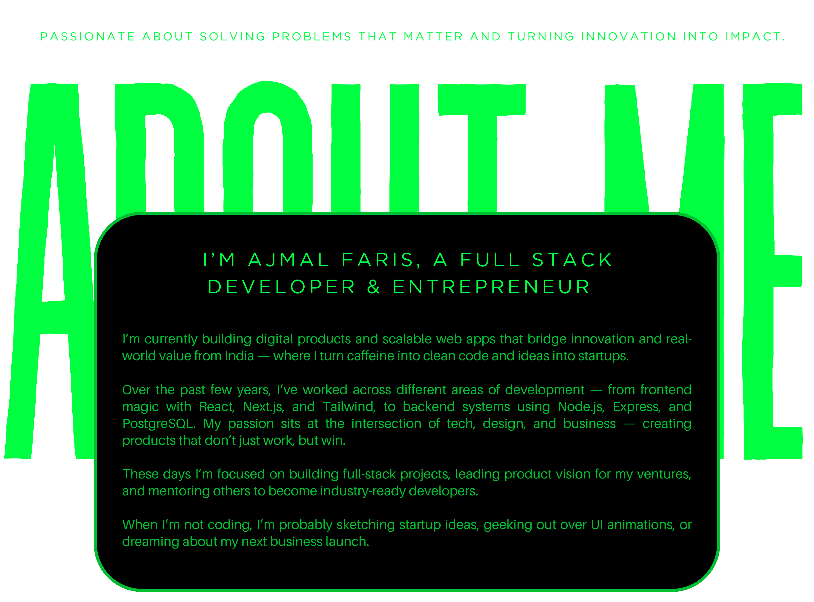
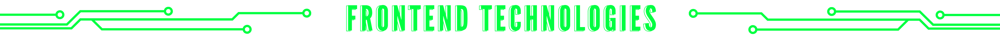
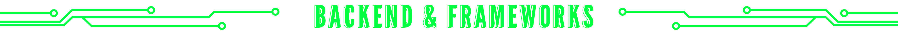
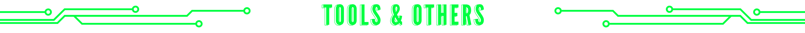
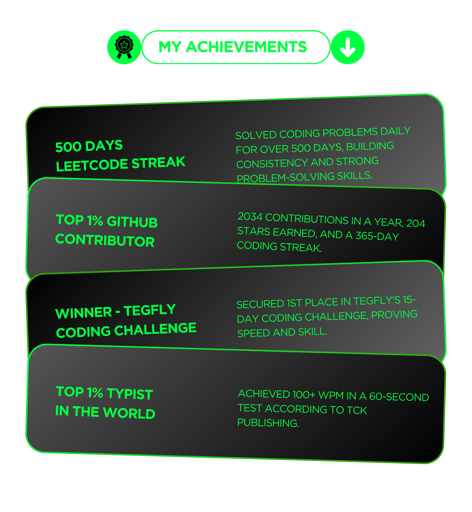

<!-- ✨ Advanced GitHub Profile README for Ajmal Faris ✨ -->

  

  

 

  

<!-- GitHub Profile Trophies (Matrix Theme) -->

  

<!-- about me -->

  

 

  

  

  <!-- Profile Views -->

  

   

  <!-- Tech Stacks -->

  

  

  

  

  

  

  

  

  

  

  

  

  

  

   

  

  

 

  <!-- My quote -->

  

  

 <!-- connect links -->

  &nbsp;&nbsp;&nbsp;&nbsp;&nbsp;&nbsp;&nbsp;&nbsp;&nbsp;&nbsp;&nbsp;&nbsp;&nbsp;&nbsp;&nbsp;&nbsp;&nbsp;&nbsp;&nbsp;&nbsp;&nbsp;&nbsp;&nbsp;&nbsp;
  &nbsp;&nbsp;&nbsp;&nbsp;
  &nbsp;&nbsp;&nbsp;&nbsp;
  &nbsp;&nbsp;&nbsp;&nbsp;
  &nbsp;&nbsp;&nbsp;&nbsp;
  
&nbsp;&nbsp;&nbsp;&nbsp;&nbsp;&nbsp;&nbsp;&nbsp;&nbsp;&nbsp;&nbsp;&nbsp;&nbsp;&nbsp;&nbsp;&nbsp;&nbsp;&nbsp;&nbsp;&nbsp;&nbsp;&nbsp;&nbsp;&nbsp;&nbsp;&nbsp;&nbsp;&nbsp;&nbsp;&nbsp;
  

