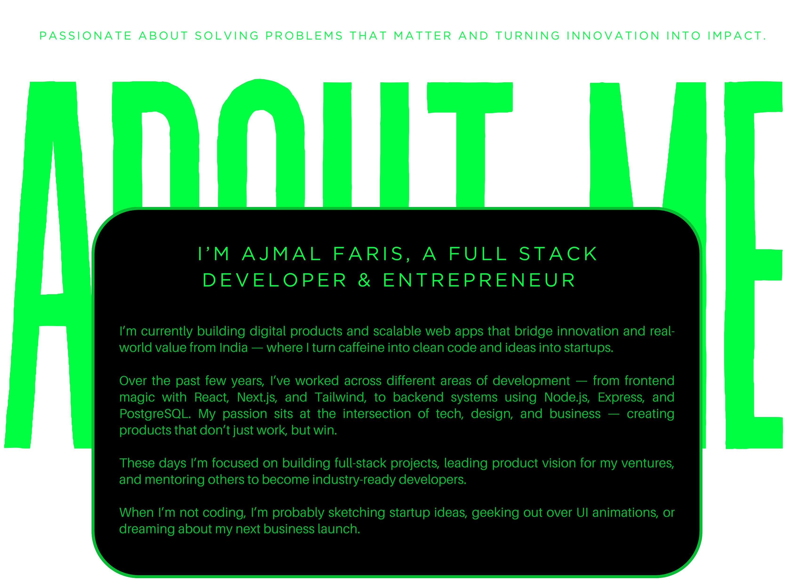
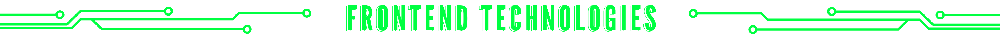
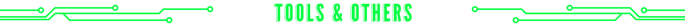
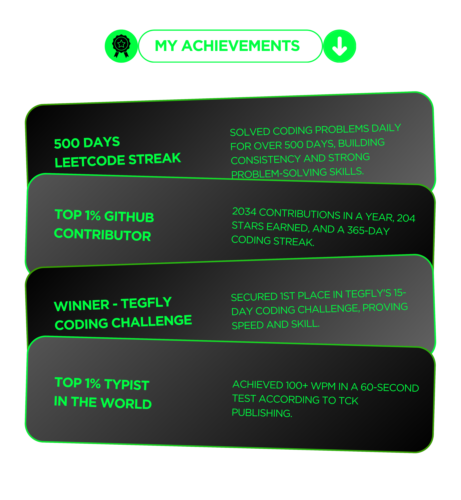

<!-- HERO -->

  

<!-- CONTRIBUTIONS -->

  

<!-- TYPING -->

  

<!-- TROPHIES -->

  

<!-- ABOUT -->

  

<!-- STATS HEADER -->

  

<!-- STATS -->

  
  

  

<!-- VIEWS -->

  

<!-- LEETCODE -->

  

<!-- LANGUAGES -->

  

  

<!-- FRONTEND -->

  

  

<!-- BACKEND -->

  

  

<!-- DATABASE -->

  

  

<!-- TOOLS -->

  

  

  

<!-- ACHIEVEMENTS -->

  

  

<!-- QUOTE -->

  

<!-- FOOTER -->

  

<!-- BUTTONS -->

  
  

<!-- SOCIAL -->

  
  
  
  
  

